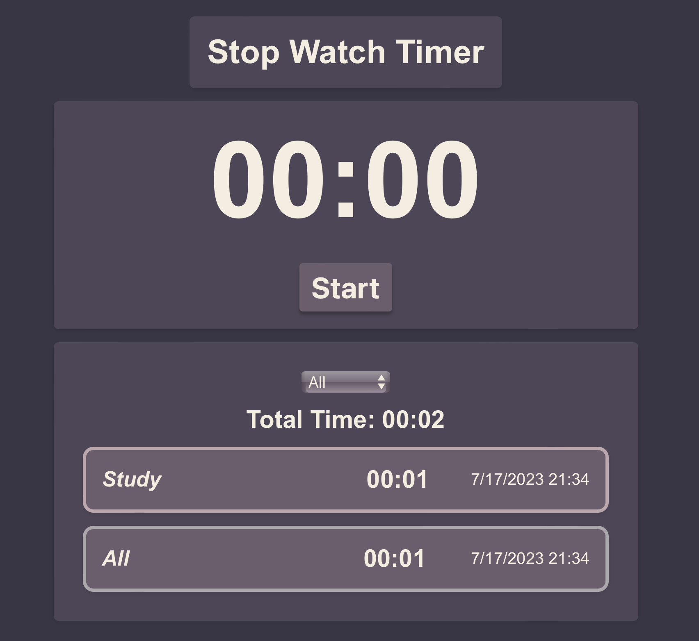
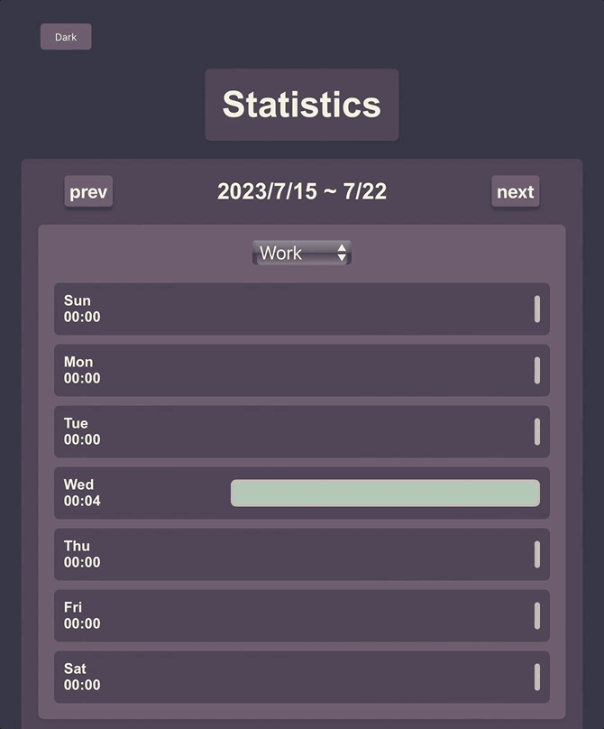

# Stop Watch 웹 애플리케이션

{: width="50%" height="50%"}

## 소개

Stop Watch는 간단한 스톱워치 시간 관리 웹 애플리케이션입니다. 사용자는 시간을 추가, 삭제 할 수 있으며, 완료한 작업을 저장할 수 있습니다. 또한 통계그래프를 볼수 있습니다.

## 주요 기능

- 시간 추가, 삭제
- 통계 그래프
- 스톱 워치

## 사용된 기술

- Front-end: React, css modules, javascript
- Deployment: netlify

## 사용 예제

{: width="50%" height="50%"}

## 개발 배경 및 과정

(프로젝트를 개발하게 된 배경, 개발하면서 겪은 어려움, 해결 방법, 배운 점 등을 작성하세요)
